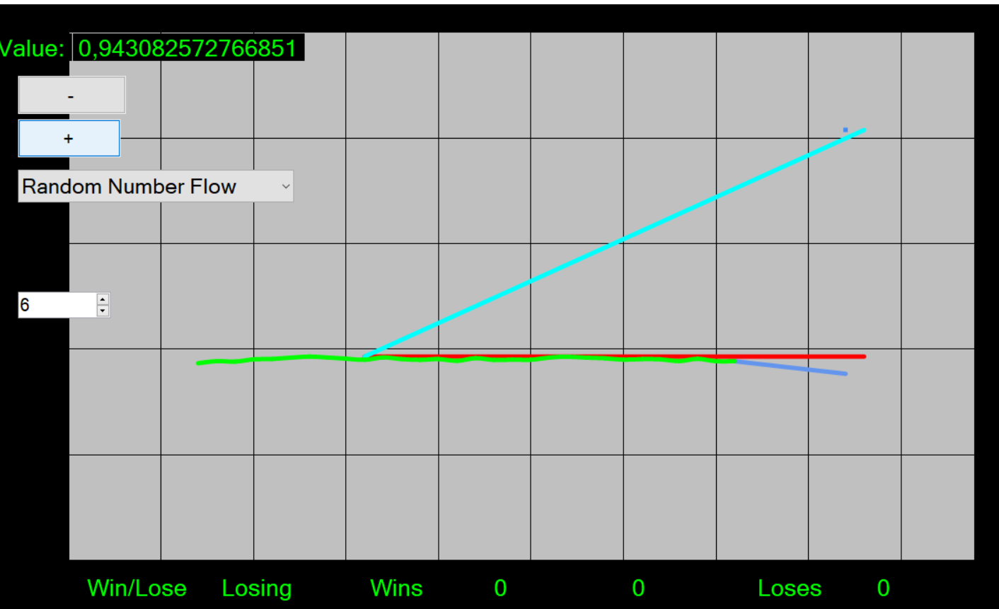

# BettingSystem
Small betting-system. Bet if a dataflow of random numbers will increase or decrease. Written as a Windows Form in Visual Studio C#.
See screenshot! Green color is old values. Red color bet value. Light blue prediction (derivate latest 20 numbers). 

